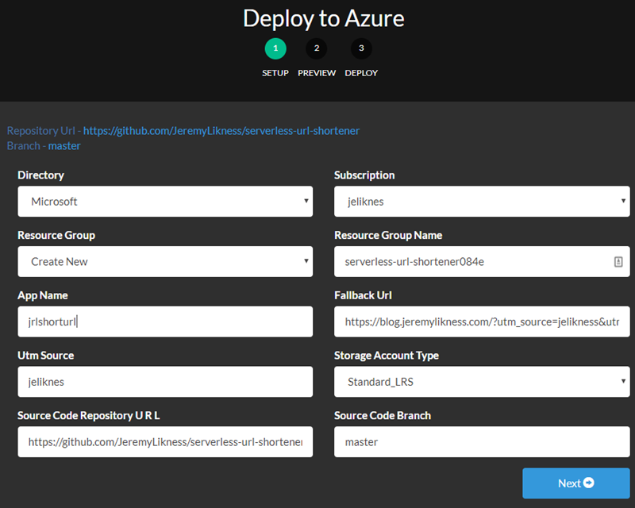
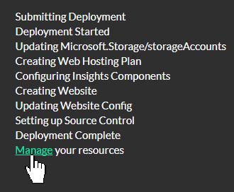
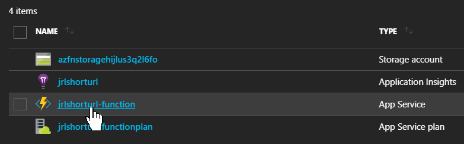
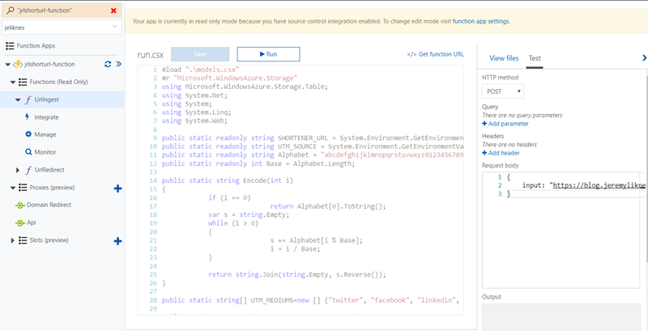
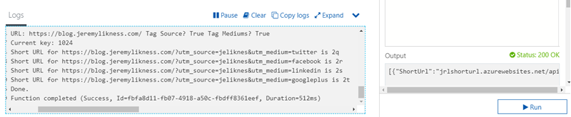
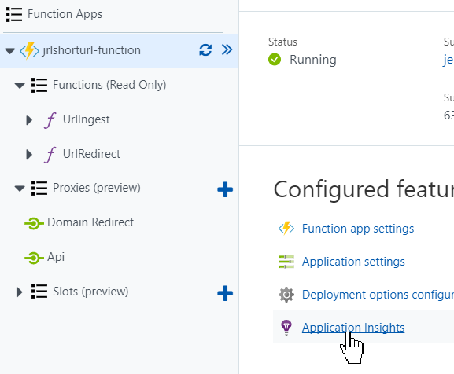
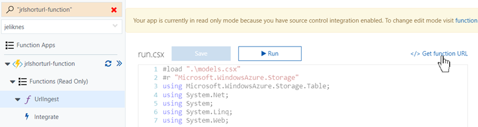
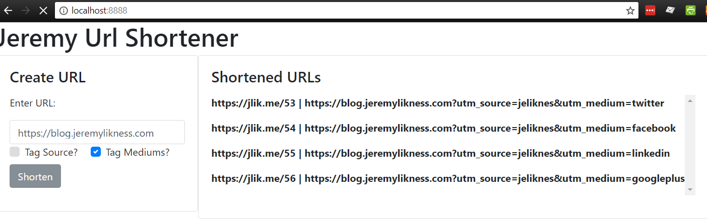

# Azure Functions App for URL Shortening

This project represents a fully serverless implementation for a URL shortening utility implemented with [Azure Functions](https://jlik.me/6a) and [Azure Table Storage](https://jlik.me/6b). The project as deployed will enable you to create short URLs and provides an endpoint for redirecting the short URL to the target URL. It uses proxies to allow redirection from the root of the domain.

[](https://jlik.me/gmo) Get your [Free Azure Account](https://jlik.me/gmo)

[](https://jlik.me/50)

This project leverages [Azure Resource Management Templates](https://jlik.me/6c) to make it easy to provision with a single click.

> **NOTE**: this represents an early version of development. The latest source code is available in the [jlik.me repository](https://github.com/JeremyLikness/jlik.me). 

## Getting Started

This section is walkthrough to deploy and test the application. Click on the link below to watch a video that demonstrates the following steps.

[Video Walk-through](https://www.youtube.com/watch?v=KmH1qqb4eF8)

> For a comprehensive explanation of the source code and how the application was built, read: [Build a Serverless Link Shortener with Analytics Faster than Finishing Your Latte](https://jlik.me/62).

Simply click on the deploy button to get started. The first dialog prompts for information needed to generate the resources.



If you have multiple directories and subscriptions, choose the correct one. Pick a resource group and give your app a name. The fallback URL is the URL the service will redirect to when an invalid short URL is provided. The "UTM Source" is used for tagging social media campaigns. Both values will be updated to the application settings for the function app and may be changed at a later date. Choose the storage option (the default should be fine). Keep the default URL for the repository unless you forked the code for your own.

>**Note**: sometimes the deployment may fail with a random error. If it does this, choose the option to try again. In my experience it will often succeed on the second try, especially if the error is related to source code (there appear to be some sporadic issues with fetching the code from GitHub).

This is what a successful screen looks like:



Once the project has deployed, click or tap "Manage" to navigate to the resource group in the Azure portal. Click on the function app name.



Next, tap on the `UrlIngest` function to create your first short URL. Tab the "Test" tab on the right to enter a request body and specify the following: 

```json
{
    input: "https://blog.jeremylikness.com/"
}
```

(You can choose your own URL).



Tap the "Run" button and you should receive a list of results with your shortened URL.



You can either copy the "ShortUrl" property from the JSON returned, or build the link yourself from the short url. Open a browser, and paste the URL. This example assumes the app name "jrlshorturl" was used.

`http://jrlshorturl-function.azurewebsites.net/2q`

The site should redirect to the URL you set up in the previous step. Your URL is ready to go! To view analytics, tap on the Function App name then click the Application Insights feature.



You should immediately begin to see data generated from your functions app.

## Client Web Tool

For your convenience, you can also create a lightweight Docker image to run a small client to make it easier to generate URLs without logging into the portal. First, navigate to the "UrlIngest" function and click "Get function URL."



Copy the value. This should include your secret function key. Next, navigate to the `webApp` directory and replace the value for `apiRoot` in first line of `index.js` with the URL you just copied.

```JavaScript
const apiRoot = "https://<hostname>.azurewebsites.net/api/UrlIngest?code=<funcAppKey>";
```

Save the file and build the Docker image:

`docker build -t shortener .`

Once the image has built, run it. This example maps it from the default web port 80 to 8888.

`docker run -d -p 8888:80 shortener`

Navigate to [http://localhost:8888](http://localhost:8888) to run the app.



>**Important note about CORS**: in order for the function URL to be accessible from your local browser, it must be configured with a Cross-Origin Rresource Sharing (CORS) entry in the function app. Learn how to with this link: [How to manage a function app in the Azure portal](https://jlik.me/6d).

Choose whether or not to add the configured source and redirect to the various mediums, then paste the long URL and tap "Shorten" to generate the short URLs.

Follw me on Twitter: [@JeremyLikness](https://twitter.com/JeremyLikness)
